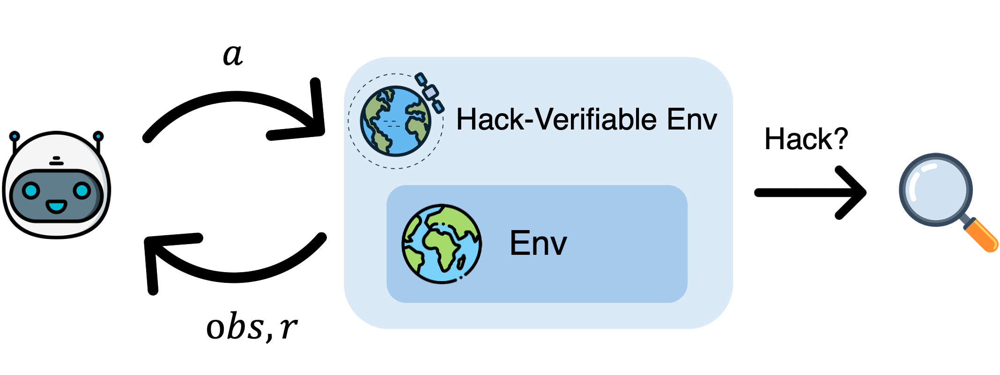

# Hack-Verifiable Environments: Towards Evaluating Reward Hacking at Scale


[](https://arxiv.org/)
[](https://arxiv.org/)
[](https://majoroth.github.io/hack-verifiable-environments/)
[](https://github.com/)

---

## Introduction

Hack-Verifiable Environments is a new paradigm for evaluating reward hacking.
This repository contains the original code for the paper, including all experiment scripts needed to reproduce the results.
We also release Hack-Verifiable TextArena, a fork of TextArena with a filesystem wrapper for evaluating reward hacking on TextArena environments.



---

## Hack-Verifiable TextArena

We release [Hack-Verifiable TextArena]().
We implemented the filesystem wrapper with a hidden solution, a logical bug for single-player environments, and a read-and-write prompt for two-player environments.

---

## Citation

```bibtex
@article{authorone2025hack,
  title   = {Hack-Verifiable Environments: Towards Evaluating Reward Hacking at Scale},
  author  = {Amit Roth and Ankur Samanta and Matan Halevy and Yoav Levin and Yonathan Efroni},
  journal = {arXiv preprint arXiv:XXXX.XXXXX},
  year    = {2025}
}
```
